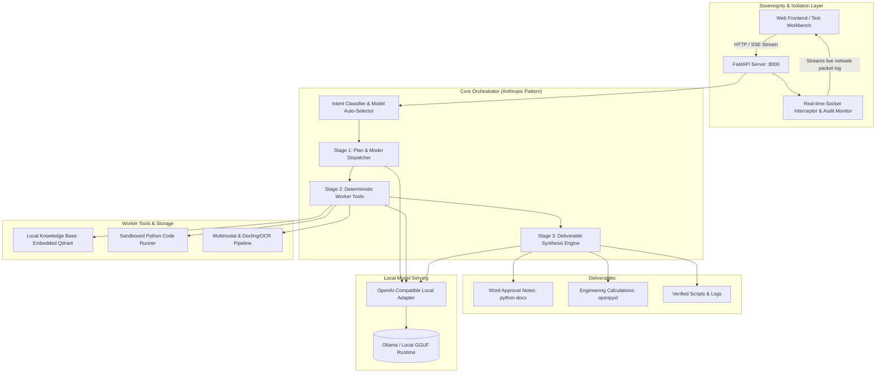

# Sovereign On-Premise Agentic AI Workbench (Backend)

Implementation plan for **Problem Statement ID: 26117** — *Sovereign On-Premise Agentic AI Workbench using Open-Weight Multimodal LLMs for Confidential Industrial Work*.

This backend is designed for refineries, PSUs, and defense-linked industrial units operating under strict air-gap compliance. It runs 100% locally on the user's machine (tested on an RTX 4050 6GB VRAM Laptop with 16GB RAM) with verifiable zero external network egress.

---

## Architecture Overview



---

## User Review Required

> [!IMPORTANT]
> **Your Requested Open-Source Model Suite**: The backend is configured directly around your specific chosen open-source models:
> - **Reasoning & Planning**: `DeepSeek-R1-Distill-Qwen-32B` (quantized GGUF / Ollama with layer offload between 6GB VRAM and 16GB RAM)
> - **Coding, Math & Complex Work**: `qwen3.8-27b` (your specific chosen model for complex coding and calculations)
> - **Vision & Engineering Drawings (P&IDs)**: `Qwen2-VL` / `Qwen-VL`
> - **Document Extraction & Layout Parsing**: `Docling` (IBM's open-source parser) + `Qwen-OCR`
>
> To ensure your **RTX 4050 (6GB VRAM) + 16GB RAM** can run the 32B and 27B models, we configure the dynamic layer offloader (`ngl`) and support aggressive quantization (`IQ2_XXS` / `Q3_K_M` / `Q4_K_M`). We also provide an instant 1-toggle fallback profile to 7B/8B counterparts (`deepseek-r1:7b`, `qwen2.5-coder:7b`) if you need rapid token generation during a fast-paced pitch.

> [!NOTE]
> **Air-Gap Sovereign Proof**: The backend hooks into Python's native socket calls. Any attempt to reach an external IP is immediately intercepted and blocked. Real-time telemetry is streamed via SSE so the judges can inspect the network monitor and verify 100% localhost-only traffic.

---

## Development Workflow & Git Protocol ("Software Developer Cadence")

> [!CAUTION]
> **Strict Anti-Vibe-Coding Git Rules**:
> 1. **Target Branch**: All work is tracked and pushed strictly on the `backend` branch.
> 2. **Incremental Atomic Commits**: The codebase will **NEVER** be committed or pushed in one giant batch. Each logical feature/phase will be committed separately with realistic, professional commit messages (e.g. `feat(config): setup app settings and model registry for qwen and deepseek`, `feat(network): implement in-process socket interceptor for air-gap audit`, etc.).
> 3. **Quality Gate ("Never Push Broken Code")**: Before **any** commit and push to GitHub, a verification check must run:
>    - Python compilation & syntax verification (`py_compile`)
>    - Unit/smoke test execution verifying that the new feature actually works as intended
>    - If any test or import fails, the issue must be resolved first. Broken code will never touch git history.

---

## Proposed Changes

The project will be organized cleanly in `/home/devsiwach/github/LSAI` with modular architecture:

```
LSAI/
├── config/
│   ├── __init__.py
│   ├── settings.py           # App configuration, paths, air-gap toggles
│   └── models.yaml           # Model registry (Laptop Demo vs Server profiles)
├── core/
│   ├── __init__.py
│   ├── network_monitor.py    # In-process socket interceptor & audit stream
│   ├── model_manager.py      # Local model adapter (Ollama / llama-server)
│   └── orchestrator.py       # 3-Stage Orchestrator-Worker agent engine
├── tools/
│   ├── __init__.py
│   ├── rag_engine.py         # Embedded Qdrant client & local embeddings
│   ├── sandbox.py            # Local sandboxed code executor (Docker + subprocess)
│   ├── file_manager.py       # Local file read/write/list tool for agent workspace
│   ├── spreadsheet.py        # Read, analyze, and manipulate uploaded .xlsx/.csv files
│   ├── doc_parser.py         # PDF, OCR, and multimodal document processor (Docling)
│   └── deliverable_gen.py    # .docx, .xlsx, .pptx deliverable generators
├── api/
│   ├── __init__.py
│   ├── main.py               # FastAPI application entrypoint
│   ├── routes_agent.py       # Agent task dispatch & SSE streaming endpoints
│   ├── routes_rag.py         # Document upload, chunking, and knowledge base search
│   ├── routes_network.py     # Live air-gap audit & network monitor stream
│   └── routes_deliverables.py# Generated file download endpoints
├── static/
│   └── index.html            # Built-in test workbench (SSE logs, network monitor)
├── data/
│   ├── samples/              # Realistic industrial demo files (P&ID, Inspection report, SOP)
│   ├── uploads/              # Incoming user files
│   └── deliverables/         # Generated output artifacts (.docx, .xlsx, .py)
├── storage/
│   └── qdrant/               # Local embedded Qdrant vector database files
├── scripts/
│   ├── setup_env.sh          # Virtual environment creation and dependency install
│   └── seed_demo_data.py     # Ingests industrial SOPs & sample reports into Qdrant
├── .gitignore                # Excludes storage/, uploads/, deliverables/, __pycache__/, .venv/
├── requirements.txt          # Python dependencies
└── README.md                 # Setup guide, architecture overview, and demo pitch script
```

---

### Phase 1: Environment & Foundation

#### [NEW] [requirements.txt](file:///home/devsiwach/github/LSAI/requirements.txt)
- `fastapi`, `uvicorn[standard]`, `sse-starlette`
- `qdrant-client`, `sentence-transformers`
- `docling`, `pypdf`, `pillow`, `pytesseract`
- `python-docx`, `openpyxl`, `python-pptx`
- `docker` (Python SDK for Docker sandbox mode)
- `httpx`, `pyyaml`, `pydantic`, `pydantic-settings`

#### [NEW] [.gitignore](file:///home/devsiwach/github/LSAI/.gitignore)
- Excludes: `storage/qdrant/`, `data/uploads/`, `data/deliverables/`, `__pycache__/`, `.venv/`, `*.pyc`, `.env`

#### [NEW] [config/settings.py](file:///home/devsiwach/github/LSAI/config/settings.py)
- Application configuration paths, air-gap strictness level, model server base URL (`http://127.0.0.1:11434/v1`), deliverable output directories.

#### [NEW] [config/models.yaml](file:///home/devsiwach/github/LSAI/config/models.yaml)
- **Primary Model Registry (Your Requested Suite)**:
  - **Reasoning**: `deepseek-r1:32b` (`DeepSeek-R1-Distill-Qwen-32B`)
  - **Coding & Math**: `qwen3.8-27b` (configured directly for complex coding and calculations)
  - **Vision / P&ID Drawings**: `qwen2-vl:7b` / `qwen2-vl`
  - **Document & OCR Parser**: `docling` + `qwen-ocr`
- **Quantization & Execution Profiles**:
  - `laptop_quantized`: Configures GGUF `IQ2_XXS` / `Q3_K_M` quantization with dynamic GPU layer offload (`ngl`) to run on RTX 4050 6GB VRAM + 16GB RAM.
  - `server_full`: Unquantized / 4-bit AWQ for 24GB+ / 48GB GPU servers.
  - `fast_fallback`: 7B/8B counterparts (`deepseek-r1:7b`, `qwen2.5-coder:7b`) if high generation speed is needed during quick demo pitches.
- Task-to-model routing rules (Code/Math -> `qwen3.8-27b`, Scanned Doc/P&ID -> `docling` + `qwen2-vl`, SOP Note/Reasoning -> `deepseek-r1:32b`).

---

### Phase 2: Sovereign Air-Gap & Model Management Layer

#### [NEW] [core/network_monitor.py](file:///home/devsiwach/github/LSAI/core/network_monitor.py)
- Monkey-patches Python's `socket.socket.connect` and `socket.create_connection`.
- Whitelists `127.0.0.1`, `localhost`, and UNIX domain sockets.
- Blocks and records any attempt to connect to external IPs/domains.
- Maintains an in-memory ring buffer of network events (`timestamp`, `destination`, `port`, `status`, `bytes_transferred`).
- Exposes an async queue for live SSE streaming to the UI.

#### [NEW] [core/model_manager.py](file:///home/devsiwach/github/LSAI/core/model_manager.py)
- Lightweight client wrapping local OpenAI-compatible endpoints (`/v1/chat/completions`).
- Supports model health checks, latency tracking, and token generation statistics.
- Graceful fallbacks if a requested model is not downloaded yet (with informative error formatting).

---

### Phase 3: Local Tools & Storage Engine

#### [NEW] [tools/rag_engine.py](file:///home/devsiwach/github/LSAI/tools/rag_engine.py)
- Initializes embedded Qdrant instance stored locally at `./storage/qdrant`.
- Local text embeddings using `sentence-transformers` (runs on local CPU or GPU, zero cloud calls).
- Document ingestion methods for industrial SOPs, equipment manuals, and past correspondence with metadata tagging (section, equipment ID, clearance).

#### [NEW] [tools/sandbox.py](file:///home/devsiwach/github/LSAI/tools/sandbox.py)
- **Dual-Mode Sandboxed Execution Engine (Docker + Subprocess Isolation)**:
  - **Mode 1: Docker Sandbox (Production / Containerized)**:
    - Runs generated Python code inside a hardened Docker container with `--network none` (strict zero network access), `--memory=512m`, `--cpus=1.0`, read-only root filesystem, and an ephemeral isolated scratch mount.
  - **Mode 2: Local Subprocess Sandbox (Zero-Dependency Fallback)**:
    - Used when Docker daemon is not running. Executes inside an isolated Python subprocess with stripped environment variables (no credentials/tokens), resource limits (`RLIMIT_AS` memory limits), execution timeouts, and network isolation.
  - **Automatic Mode Detection**: Auto-detects if Docker is available on the machine; if available, uses Docker container isolation; otherwise gracefully executes via the hardened subprocess sandbox and records the isolation type in the audit log.
  - **Code Output Verification**: Captures stdout, stderr, execution return codes, and feeds any syntax/runtime errors back to the orchestrator for self-correction.

#### [NEW] [tools/doc_parser.py](file:///home/devsiwach/github/LSAI/tools/doc_parser.py)
- **Docling Integration**: Uses IBM's `docling` pipeline for deep layout analysis, table extraction, and structured markdown conversion of industrial inspection reports and scanned PDFs.
- **Vision Pre-processor**: Prepares engineering drawings (P&IDs) and diagrams for `Qwen2-VL` multimodal visual reasoning.
- **OCR Fallback**: Local OCR (Tesseract / Pillow / Qwen-OCR) for handwritten annotations and poor-quality scans.

#### [NEW] [tools/deliverable_gen.py](file:///home/devsiwach/github/LSAI/tools/deliverable_gen.py)
- **Word Approval Note Generator**: Generates formatted PSU/government `.docx` note sheets with reference number, subject header, tabular findings, calculation annexures, and formal recommendation blocks.
- **Excel Calculation Sheet**: Generates `.xlsx` workbooks with styled headers, formulas, and verification summaries.
- **Presentation Builder**: Generates `.pptx` summary slides for executive briefings.

#### [NEW] [tools/file_manager.py](file:///home/devsiwach/github/LSAI/tools/file_manager.py)
- **Agent File Read/Write/List Tool**: Enables the orchestrator to read uploaded files (`.txt`, `.csv`, `.json`, `.md`), write intermediate results to the workspace, and list available files in `data/uploads/` and `data/deliverables/`.
- Restricted to the project workspace directories only (no arbitrary filesystem access).

#### [NEW] [tools/spreadsheet.py](file:///home/devsiwach/github/LSAI/tools/spreadsheet.py)
- **Spreadsheet Read & Manipulation**: Reads uploaded `.xlsx` and `.csv` files using `openpyxl` / `csv`, extracts cell data, column headers, and sheet names.
- **Data Analysis Support**: Provides structured summaries (row counts, column types, basic statistics) that the agent can use for calculations, filtering, or report generation.
- **In-Place Edit**: Allows the agent to modify cell values, add rows/columns, and save back to a new `.xlsx` deliverable.

---

### Phase 4: 3-Stage Orchestrator & API Server

#### [NEW] [core/orchestrator.py](file:///home/devsiwach/github/LSAI/core/orchestrator.py)
- **Stage 1 (Plan & Route)**: Classifies user prompt into task category, selects the optimal open-weight model, and generates a structured multi-step plan.
- **Stage 2 (Worker Execution)**: Executes tool actions sequentially (e.g. document parsing -> RAG lookup -> sandbox calculation).
- **Stage 3 (Synthesis)**: Uses the selected drafting model to synthesize findings into the requested deliverable (.docx, .xlsx, .py).
- **Self-Correction & Retry Loop**: If any worker step fails (sandbox error, malformed output, missing data), the orchestrator feeds the error back to the model and re-attempts the step (up to 3 retries) before reporting failure. This ensures the agent *iterates* on tasks rather than stopping at the first error.
- **Conversation Context Manager**: Maintains an in-memory conversation history per session (list of `{role, content}` message dicts) so multi-turn follow-up requests retain full context from previous exchanges within the same session.
- Emits real-time SSE events at each milestone for live visualization.

#### [NEW] [api/main.py](file:///home/devsiwach/github/LSAI/api/main.py)
- FastAPI app setup, CORS, lifespan startup event (initializes network interceptor and Qdrant).
- Mounts static files and routes.

#### [NEW] [api/routes_agent.py](file:///home/devsiwach/github/LSAI/api/routes_agent.py)
- `POST /api/agent/run`: Starts an agent task.
- `GET /api/agent/stream/{task_id}`: SSE stream providing live thoughts, tool logs, and deliverable download links.

#### [NEW] [api/routes_network.py](file:///home/devsiwach/github/LSAI/api/routes_network.py)
- `GET /api/network/stream`: SSE stream broadcasting network monitor events.
- `GET /api/network/stats`: Aggregated summary (total blocked packets, localhost bytes, 0 external egress proof).

#### [NEW] [api/routes_rag.py](file:///home/devsiwach/github/LSAI/api/routes_rag.py)
- `POST /api/rag/upload`: Ingests an SOP / manual PDF or TXT into embedded Qdrant.
- `GET /api/rag/search`: Queries the local knowledge base.

#### [NEW] [api/routes_deliverables.py](file:///home/devsiwach/github/LSAI/api/routes_deliverables.py)
- `GET /api/deliverables/download/{filename}`: Secure file download endpoint.

---

### Phase 5: Demo Datasets, Test Workbench & Verification

#### [NEW] [data/samples/](file:///home/devsiwach/github/LSAI/data/samples/)
- `inspection_report_sample.pdf`: Scanned industrial refinery inspection report (corrosion findings, ultrasonic thickness measurements).
- `pid_drawing_sample.png`: Open-source Piping & Instrumentation Diagram sample.
- `refinery_sop_402.txt`: Standard Operating Procedure for high-pressure safety valves and approval hierarchy.

#### [NEW] [scripts/seed_demo_data.py](file:///home/devsiwach/github/LSAI/scripts/seed_demo_data.py)
- Pre-indexes the sample SOP into Qdrant so the RAG engine is immediately searchable on first launch.

#### [NEW] [static/index.html](file:///home/devsiwach/github/LSAI/static/index.html)
- Clean, dark-themed test workbench with:
  - Live Air-Gap Status Shield (showing green "100% AIR-GAPPED: 0 EXTERNAL CALLS" with live packet log)
  - Active Model Auto-Selector badge (displays which open-weight model was dynamically picked)
  - Prompt input & file upload for inspection reports / P&IDs
  - Real-time step-by-step agent execution log via SSE
  - 1-click download buttons for generated Word (.docx) approval notes and Excel sheets

---

## Verification Plan

### Automated Tests
1. **Air-Gap Interceptor Verification**:
   - Run a test script that deliberately attempts to connect to `8.8.8.8` or `google.com` and verifies that the socket interceptor raises a `SecurityException`, logs the event, and prevents any external packet from leaving the host.
2. **Qdrant Vector Retrieval Test**:
   - Ingest a sample SOP text into embedded Qdrant and verify similarity query retrieval with exact citation references.
3. **Sandbox Execution & Isolation Test**:
   - Run a sample calculation script in the sandbox; verify stdout capture, execution timeout enforcement, and proper error handling.
4. **Deliverable Generation Test**:
   - Run `deliverable_gen.py` to create sample `.docx` and `.xlsx` files; verify they open cleanly and contain the required formatting.

### Manual Verification
1. Start the FastAPI server on `http://127.0.0.1:8000`.
2. Open `http://127.0.0.1:8000/demo` in a browser.
3. Run the 4 primary demo scenarios required by the problem statement:
   - **Scenario 1 (Model Auto-Selection & Code Execution)**: Prompt: *"Write a Python calculation for pipe wall minimum allowable thickness under ASME B31.3 and verify it in the sandbox"*. Verify router picks Coder model and sandbox executes cleanly.
   - **Scenario 2 (End-to-End Agentic Task: Scanned Report to Word Approval Note)**: Upload `inspection_report_sample.pdf` and ask for an official approval note. Verify OCR extraction, RAG cross-referencing with SOP 402, and download the generated `.docx` file.
   - **Scenario 3 (Multimodal P&ID Understanding)**: Upload `pid_drawing_sample.png` and ask for valve tags and instrument identification.
   - **Scenario 4 (Air-Gap Sovereign Proof)**: Observe the live Network Monitor counter during all tasks, verifying 0 external network calls.
