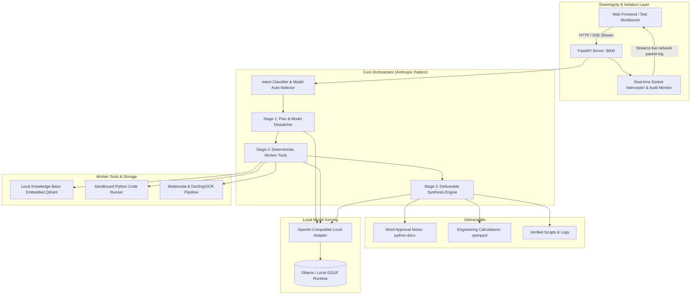

# Sovereign On-Premise Agentic AI Workbench (Backend)

Implementation plan for **Problem Statement ID: 26117** — *Sovereign On-Premise Agentic AI Workbench using Open-Weight Multimodal LLMs for Confidential Industrial Work*.

This backend is designed for refineries, PSUs, and defense-linked industrial units operating under strict air-gap compliance. It runs 100% locally on the user's machine (tested on an RTX 4050 6GB VRAM Laptop with 16GB RAM) with verifiable zero external network egress.

---

## Architecture Overview



---

## User Review Required

> [!IMPORTANT]
> **Your Requested Open-Source Model Suite**: The backend is configured directly around your specific chosen open-source models:
> - **Reasoning & Planning**: `DeepSeek-R1-Distill-Qwen-32B` (quantized GGUF / Ollama with layer offload between 6GB VRAM and 16GB RAM)
> - **Coding, Math & Complex Work**: `qwen3.8-27b` (your specific chosen model for complex coding and calculations)
> - **Vision & Engineering Drawings (P&IDs)**: `Qwen2-VL` / `Qwen-VL`
> - **Document Extraction & Layout Parsing**: `Docling` (IBM's open-source parser) + `Qwen-OCR`
>
> To ensure your **RTX 4050 (6GB VRAM) + 16GB RAM** can run the 32B and 27B models, we configure the dynamic layer offloader (`ngl`) and support aggressive quantization (`IQ2_XXS` / `Q3_K_M` / `Q4_K_M`). We also provide an instant 1-toggle fallback profile to 7B/8B counterparts (`deepseek-r1:7b`, `qwen2.5-coder:7b`) if you need rapid token generation during a fast-paced pitch.

> [!NOTE]
> **Air-Gap Sovereign Proof**: The backend hooks into Python's native socket calls. Any attempt to reach an external IP is immediately intercepted and blocked. Real-time telemetry is streamed via SSE so the judges can inspect the network monitor and verify 100% localhost-only traffic.

---

## Development Workflow & Git Protocol ("Software Developer Cadence")

> [!CAUTION]
> **Strict Anti-Vibe-Coding Git Rules**:
> 1. **Target Branch**: All work is tracked and pushed strictly on the `backend` branch.
> 2. **Incremental Atomic Commits**: The codebase will **NEVER** be committed or pushed in one giant batch. Each logical feature/phase will be committed separately with realistic, professional commit messages (e.g. `feat(config): setup app settings and model registry for qwen and deepseek`, `feat(network): implement in-process socket interceptor for air-gap audit`, etc.).
> 3. **Quality Gate ("Never Push Broken Code")**: Before **any** commit and push to GitHub, a verification check must run:
>    - Python compilation & syntax verification (`py_compile`)
>    - Unit/smoke test execution verifying that the new feature actually works as intended
>    - If any test or import fails, the issue must be resolved first. Broken code will never touch git history.

---

## Proposed Changes

The project will be organized cleanly in `/home/devsiwach/github/LSAI` with modular architecture:

```
LSAI/
├── config/
│   ├── __init__.py
│   ├── settings.py           # App configuration, paths, air-gap toggles
│   └── models.yaml           # Model registry (Laptop Demo vs Server profiles)
├── core/
│   ├── __init__.py
│   ├── network_monitor.py    # In-process socket interceptor & audit stream
│   ├── model_manager.py      # Local model adapter (Ollama / llama-server)
│   └── orchestrator.py       # 3-Stage Orchestrator-Worker agent engine
├── tools/
│   ├── __init__.py
│   ├── rag_engine.py         # Embedded Qdrant client & local embeddings
│   ├── sandbox.py            # Local sandboxed code executor (Docker + subprocess)
│   ├── file_manager.py       # Local file read/write/list tool for agent workspace
│   ├── spreadsheet.py        # Read, analyze, and manipulate uploaded .xlsx/.csv files
│   ├── doc_parser.py         # PDF, OCR, and multimodal document processor (Docling)
│   └── deliverable_gen.py    # .docx, .xlsx, .pptx deliverable generators
├── api/
│   ├── __init__.py
│   ├── main.py               # FastAPI application entrypoint
│   ├── routes_agent.py       # Agent task dispatch & SSE streaming endpoints
│   ├── routes_rag.py         # Document upload, chunking, and knowledge base search
│   ├── routes_network.py     # Live air-gap audit & network monitor stream
│   └── routes_deliverables.py# Generated file download endpoints
├── static/
│   └── index.html            # Built-in test workbench (SSE logs, network monitor)
├── data/
│   ├── samples/              # Realistic industrial demo files (P&ID, Inspection report, SOP)
│   ├── uploads/              # Incoming user files
│   └── deliverables/         # Generated output artifacts (.docx, .xlsx, .py)
├── storage/
│   └── qdrant/               # Local embedded Qdrant vector database files
├── scripts/
│   ├── setup_env.sh          # Virtual environment creation and dependency install
│   └── seed_demo_data.py     # Ingests industrial SOPs & sample reports into Qdrant
├── .gitignore                # Excludes storage/, uploads/, deliverables/, __pycache__/, .venv/
├── requirements.txt          # Python dependencies
└── README.md                 # Setup guide, architecture overview, and demo pitch script
```

---

### Phase 1: Environment & Foundation — [COMPLETED]

- [x] **requirements.txt**: Core and optional dependencies specified.
- [x] **.gitignore**: Safe exclude rules for local air-gap storage while tracking samples.
- [x] **config/settings.py**: Hardware profiles (`laptop_quantized`, `server_full`, `fast_fallback`), paths, air-gap toggles.
- [x] **config/models.yaml**: Registry mapping tasks to DeepSeek-R1-32B, Qwen-3.8-27B, Qwen2-VL, and Docling/OCR.

---

### Phase 2: Sovereign Air-Gap & Model Management Layer — [COMPLETED]

- [x] **core/network_monitor.py**: Native socket interceptor, loopback whitelist, circular ring buffer, SSE broadcasting, active verify probe.
- [x] **core/model_manager.py**: Local OpenAI-compatible client, health check, latency tracking, completion streaming, offline fallbacks.

---

### Phase 3: Local Tools & Storage Engine — [COMPLETED]

- [x] **tools/rag_engine.py**: Local embedded Qdrant vector database, dense embeddings, chunking algorithms.
- [x] **tools/sandbox.py**: Dual-mode containerized execution (Docker `--network none` + Subprocess sandbox with memory limits and socket blocking).
- [x] **tools/doc_parser.py**: Multimodal document parser (Docling -> pypdf -> native stream fallback), vision preprocessor, local OCR.
- [x] **tools/deliverable_gen.py**: PSU Word (.docx) approval notes, Excel (.xlsx) calculation workbooks, PPT (.pptx) briefings, verified Python scripts (.py).
- [x] **tools/file_manager.py**: Jailed filesystem operations with path traversal prevention.
- [x] **tools/spreadsheet.py**: Spreadsheet analysis and manipulation engine (.xlsx / .csv).

---

### Phase 4: 3-Stage Orchestrator & API Server — [COMPLETED]

- [x] **core/orchestrator.py**: 3-Stage Orchestrator (Intent classification across 6 categories, deterministic worker tool execution with self-correction retry loop up to 3 retries, deliverable synthesis, multi-turn session retention).
- [x] **api/main.py**: FastAPI app, airgap lifespan management, CORS, static workbench mount (`/demo`), SecurityException 403 handler.
- [x] **api/routes_agent.py**: `/api/agent/run`, `/api/agent/stream/{task_id}`, `/api/agent/task/{task_id}`, `/api/agent/tasks`, `/api/agent/cancel/{task_id}`, `/api/agent/history/{session_id}`.
- [x] **api/routes_network.py**: `/api/network/stats`, `/api/network/events`, `/api/network/stream`, `/api/network/verify`.
- [x] **api/routes_rag.py**: `/api/rag/upload`, `/api/rag/ingest`, `/api/rag/search`, `/api/rag/info`, `/api/rag/samples`.
- [x] **api/routes_deliverables.py**: `/api/deliverables/download/{filename}`, `/api/deliverables/list`, `/api/deliverables/info/{filename}`, `/api/deliverables/{filename}`.

---

### Phase 5: Demo Datasets, Test Workbench & Verification — [COMPLETED]

- [x] **data/samples/refinery_sop_402.txt**: Authentic industrial Standard Operating Procedure for high-pressure PSVs, ASME B31.3 limits, and PSU sign-off hierarchy.
- [x] **data/samples/inspection_report_sample.pdf**: Standard-compliant scanned PDF detailing ultrasonic thickness gauging on Line 10-HC-402-CS300 and pitting corrosion findings.
- [x] **data/samples/pid_drawing_sample.png**: High-resolution technical Piping & Instrumentation Diagram with Column C-101, PSV-402, PCV-101, and transmitters.
- [x] **scripts/generate_samples.py**: Standalone industrial demo dataset generator.
- [x] **scripts/seed_demo_data.py**: Automated demo data seeder pre-indexing SOP and PDF report into embedded Qdrant with `--verify` and `--force` CLI flags.
- [x] **scripts/setup_env.sh**: Complete environment setup bash script (`.venv` creation, dependency install, directory hierarchy, and seeding).
- [x] **static/index.html**: Air-gapped dark-themed test workbench with:
  - Live Air-Gap Status Shield (glowing green badge, real-time packet counters, socket log SSE stream).
  - Model Auto-Selector badge displaying the dynamic model chosen for the task.
  - 4 One-Click Demo Scenario buttons (ASME B31.3 calculation, scanned report to Word approval note, multimodal P&ID understanding, live socket intercept probe).
  - 3-Stage live agent execution terminal streaming thoughts, step progress, self-correction logs, and artifact download links.
  - Deliverables shelf with 1-click download buttons for .docx, .xlsx, .pptx, and .py files.
  - Embedded Qdrant RAG explorer with interactive vector query box.
- [x] **tests/test_phase5_workbench_and_samples.py**: 14 verification tests covering sample datasets, seeding script, static web UI, and all 4 end-to-end demo scenarios. Total project test suite: 106 passed tests.

---

## Verification Plan

### Automated Tests
1. **Air-Gap Interceptor Verification**:
   - Run a test script that deliberately attempts to connect to `8.8.8.8` or `google.com` and verifies that the socket interceptor raises a `SecurityException`, logs the event, and prevents any external packet from leaving the host.
2. **Qdrant Vector Retrieval Test**:
   - Ingest a sample SOP text into embedded Qdrant and verify similarity query retrieval with exact citation references.
3. **Sandbox Execution & Isolation Test**:
   - Run a sample calculation script in the sandbox; verify stdout capture, execution timeout enforcement, and proper error handling.
4. **Deliverable Generation Test**:
   - Run `deliverable_gen.py` to create sample `.docx` and `.xlsx` files; verify they open cleanly and contain the required formatting.

### Manual Verification
1. Start the FastAPI server on `http://127.0.0.1:8000`.
2. Open `http://127.0.0.1:8000/demo` in a browser.
3. Run the 4 primary demo scenarios required by the problem statement:
   - **Scenario 1 (Model Auto-Selection & Code Execution)**: Prompt: *"Write a Python calculation for pipe wall minimum allowable thickness under ASME B31.3 and verify it in the sandbox"*. Verify router picks Coder model and sandbox executes cleanly.
   - **Scenario 2 (End-to-End Agentic Task: Scanned Report to Word Approval Note)**: Upload `inspection_report_sample.pdf` and ask for an official approval note. Verify OCR extraction, RAG cross-referencing with SOP 402, and download the generated `.docx` file.
   - **Scenario 3 (Multimodal P&ID Understanding)**: Upload `pid_drawing_sample.png` and ask for valve tags and instrument identification.
   - **Scenario 4 (Air-Gap Sovereign Proof)**: Observe the live Network Monitor counter during all tasks, verifying 0 external network calls.
